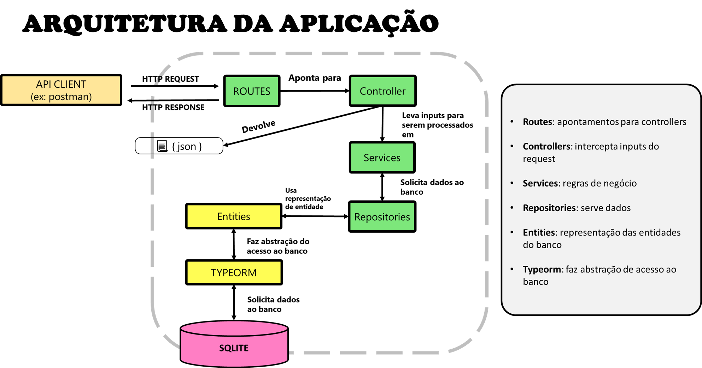

<h1 align="center">
    
   Node typescript api chat manager
</h1>

<p align="center">
  
</p>

## ⚙️ Objetivo
Uma api que gerencia mensagens de um chat de serviço.

## 🌐 Tecnologias e Conceitos Implementados

🧩 Esse projeto foi desenvolvido usando as seguintes tecnologias:

-  Node v14.15.1 (plataforma)
-  Typescript v4.2.4 (linguagem)
-  Sqlite v5.0.2 (banco de dados)
-  Npm v6.14.8 (gerenciador de pacotes)

🧩 Conceitos/Técnicas utilizadas:

- arquitetura basica orientada a services
- conceito de repositories para ter uma camada de acesso a banco
- usado typeorm para interagir com banco de dados

🧩 Dependências de produção utilizadas:

- express: 
    usado para abstrair e criar aplicações com protocolo http mais fácil
- typeorm:
    cria uma abstração entre a aplicação e o banco
- reflect-metadata:
    decorators que são utilizados juntos ao orm
- sqlite3:
    banco de dados minimalista em arquivo físico
- uuid:
    serviço para gerar ids únicos universais
- dotenv:
    um arquivo de variáveis de ambiente
- cors:
    controle de Cross-origin Resource Sharing para restringir quais endereços podem chamar api ou não

🧩 Dependências de dev utilizadas:

- typescript:
    superset que adicionar tipagem e palavras reservadas mais declarativas para trabalhar com javascript orientado a objetos de maneira mais fácil

- ts-node-dev:
    versão do nodemon para typescript, restarta servidor automaticamente ao detectar alterações e interpreta typescript diretamente
  

## ✅ Features

* Criar usuários de comunicação do chat
* Enviar mensagens a um chat
* Listar mensagens de um chat

## ⚡ Scripts
inicia aplicação em modo dev
```js
    start:dev
```
chamada do cli do typeorm
```js
    typeorm
```

## 📂 Arquitetura

### Diagrama


### Arquitetura de pastas
    📦src
    ┣ 📂controllers             interceptam as requições http
    ┣ 📂database                tudo que diz respeito a banco de dados
    ┃ ┣ 📂migrations                rotinas de criação/deleção do banco
    ┃ ┣ 📜database.sqlite           banco de dados SQLITE
    ┣ 📂entities                representação das entidades do banco
    ┣ 📂repositories            classes que servem dados do banco para o app
    ┣ 📂routes                  apontamentos para controllers
    ┃ ┗ 📜routes.ts                 arquivo principal que consolida rotas
    ┣ 📂services                regras de negócios
    ┣ 📜app.ts                  arquivo que inicia o app
    ┗ 📜server.ts               configurações gerais do servidor


## ⛏ Trabalhando com migrations

### criar migrations:

```js
node --require ts-node/register ./node_modules/typeorm/cli.js "migration:create" "-n" "nomeDaMigration"
```
```js
//usando script do package.json
npx typeorm migration:create -n nomeDaMigration
```

### rodar migrations
```js
npm run typeorm migration:run
```

### voltar migrations
```js
npm run typeorm migration:revert
```

## todos:
- [ ] Criar erros do dominio
- [ ] Usar Eslint

## 📝 Licença 
This project is under the MIT license. See the [LICENSE] for more information.

## Autor

| [<br><sub>Felipe Aguiar</sub>](https://github.com/felipeAguiarCode) |
| :---: |
|[Linkedin](www.linkedin.com/in/felipe-aguiar-047)|