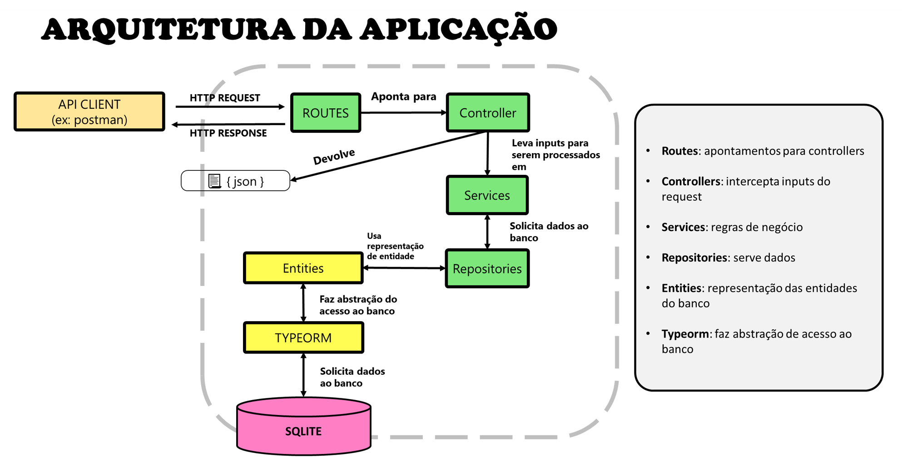

## ⚙️ Objetivo
Uma api que gerencia mensagens de um chat de serviço

## 🌐 Tecnologias e Conceitos Implementados

🧩 Esse projeto foi desenvolvido usando as seguintes tecnologias:

- Node (plataforma)
- Typescript (linguagem)

🧩 Conceitos/Técnicas utilizadas:

🧩 Dependências de produção utilizadas:

- express: 
    usado para abstrair e criar aplicações com protocolo http mais fácil
- typeorm:
    cria uma abstração entre a aplicação e o banco
- reflect-metadata:
    decorators que são utilizados juntos ao orm
- sqlite3:
    banco de dados minimalista em arquivo físico
- uuid:
    serviço para gerar ids únicos universais

🧩 Dependências de dev utilizadas:

- ts-node-dev:
    
- typescript:

## ⚡ Scripts

## ✅ Features

* Criar usuários de comunicação do chat
* Enviar mensagens a um chat
* Listar mensagens de um chat

## 📂 Arquitetura

### Diagrama


### Arquitetura de pastas
    📦src
    ┣ 📂controllers             interceptam as requições http
    ┣ 📂database                tudo que diz respeito a banco de dados
    ┃ ┣ 📂migrations                rotinas de criação/deleção do banco
    ┃ ┣ 📜database.sqlite           banco de dados SQLITE
    ┣ 📂entities                representação das entidades do banco
    ┣ 📂repositories            classes que servem dados do banco para o app
    ┣ 📂routes                  apontamentos para controllers
    ┃ ┗ 📜routes.ts                 arquivo principal que consolida rotas
    ┣ 📂services                regras de negócios
    ┣ 📜app.ts                  arquivo que inicia o app
    ┗ 📜server.ts               configurações gerais do servidor


## ⛏ Trabalhando com migrations

### criar migrations:

```js
node --require ts-node/register ./node_modules/typeorm/cli.js "migration:create" "-n" "nomeDaMigration"
```
```js
//usando script do package.json
npx typeorm migration:create -n CreateUsers
```

### rodar migrations
```js
npm run typeorm migration:run
```

### voltar migrations
```js
npm run typeorm migration:revert
```

todos:
- [ ] criar erros do dominio

## Autor

| [<br><sub>Felipe Aguiar</sub>](https://github.com/felipeAguiarCode) |
| :---: |
|[Linkedin](www.linkedin.com/in/felipe-aguiar-047)|